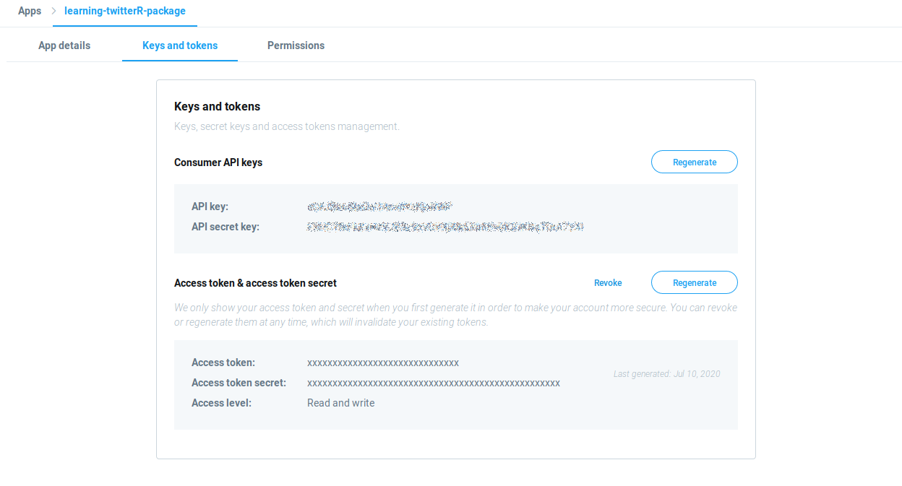

## Using the Twitter API

In order to use the Twitter API, you need to get a set of API keys.
Follow these steps, in order to register and get the keys.

## Signup

(*Skip this step, if you already have a Twitter account.*)

You can register for a free Twitter account, on this link:

https://twitter.com/i/flow/signup

## Register an App

Go to this url and create an App:

https://developer.twitter.com/en/apps

## Get the keys

Once the app is registered, it should appear in the main dashboard. Click on details, and choose the "Key and tokens" tab.

Take note of your credentials.

