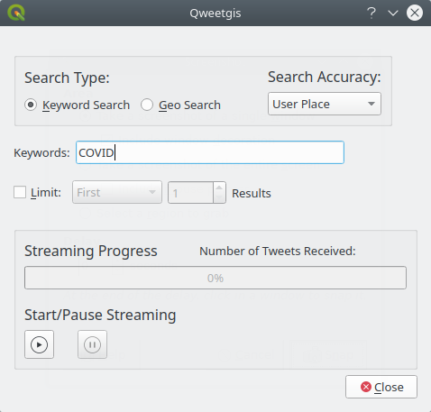
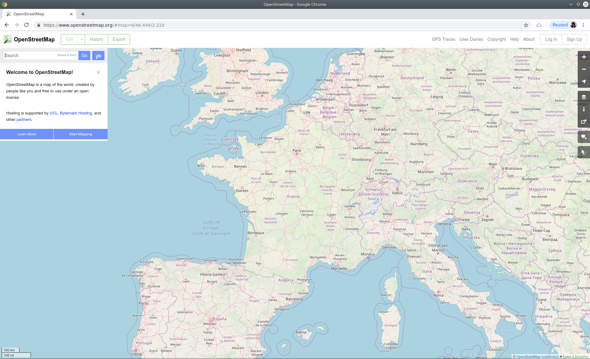
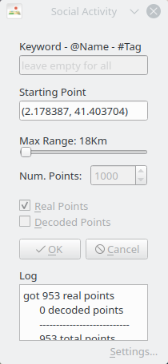

# Visualizing geo located tweets

Social media are a powerful crowdsource of geo data. In addition to the text attributes, they tell us where people are, in near real-time.


Twitter is one of the most developer friendly social networks, providing free access to a generous API to crawl data.

The goal of this project is to consume, process and display a stream of geolocated tweets. This project includes two exercises:

1. Visualize geo-located Tweets, filtered by keyword
2. Relate geo-located tweets with other geo data

In order to do that, we will use different QGIS plugins:
- Qweetgis
- Social Activity
- Quick OSM
- OpenLayers

These exercises will cover the following topics:

- Cartography
- Projections
- Spatial queries
- Ingesting stream data
- Web map publishing

## Setup

Before starting the project, make sure to install QGIS:

https://github.com/doublebyte1/bts_geospatial/blob/master/INSTALL_QGIS.md

And to register for Twitter developer API keys:

https://github.com/doublebyte1/DA-GIS-project/blob/master/dev_twitter.md

## Visualize geo-located Tweets, filtered by keyword

The goal of this exercise is to:
- Display geo-located Tweets in real-time.
- Create a webmap to publish the results.

Install the queetgis plugin, from the QGIS plugin manager: 

https://plugins.qgis.org/plugins/qweetgis/

Add a background map, either using the [OpenLayers plugin](https://plugins.qgis.org/plugins/openlayers_plugin/), or downloading a Shapefile with the countries:

https://github.com/doublebyte1/bts_geospatial/blob/master/World_Countries.rar

Pull the plugin menu, to do a search by keyword:



Searches by exact location do not result in a lot of Tweets, so we will use place instead.

User place:

```JSON
{
   "place": {
     "id": "fd70c22040963ac7",
     "url": "https:\/\/api.twitter.com\/1.1\/geo\/id\/fd70c22040963ac7.json",
     "place_type": "city",
     "name": "Boulder",
     "full_name": "Boulder, CO",
     "country_code": "US",
     "country": "United States",
     "contained_within": [

     ],
     "bounding_box": {
       "type": "Polygon",
       "coordinates": [
         [
           [-105.301758, 39.964069],
           [-105.301758, 40.094551],
           [-105.178142, 40.094551],
           [-105.178142, 39.964069]
         ]
       ]
     },
     "attributes": {}
   }
}
```

Exact location:

```JSON
{
    "geo": {
        "type": "Point",
        "coordinates": [40.0160921, -105.2812196]
    },
    "coordinates": {
        "type": "Point",
        "coordinates": [-105.2812196, 40.0160921]
    }
}
```
Choose a keyword and start the streaming.

TODO: Publish the results in qgis2web

https://plugins.qgis.org/plugins/qgis2web/

## Relate geo-located tweets with other geo data

The goal of this exercise is to display geo,located Tweets around a given location, and relate it with other geo data which characterize the city, around which infrastructure people are moving. We will get the city data from the OpenStreetMap (OSM) project.

https://www.openstreetmap.org/

OSM is a collaborative project to create a free editable map of the world. 
- Created in the UK, in 2004.
- Restrictions on use or availability of map information across much of the world
- Advent of inexpensive portable satellite navigation devices.
- Inspired by wikipedia.
- More than 2M registered users
- Open Database License
- Replaced Google Maps



Install the social activity plugin:

https://plugins.qgis.org/plugins/SocialActivity/

Grab the real points around a location on the map:



Install the QuickOSM plugin:

https://plugins.qgis.org/plugins/QuickOSM/

TODO: pull the restaurants/bars in Barcelona and query for the tweets around an 100 buffers of these points.

## References

https://medium.com/@compatt84/qweetgis-qgis-3-plugin-for-twitter-93005f2e5ec8

https://github.com/tomchadwin/qgis2web

https://www.qgistutorials.com/tr/docs/web_mapping_with_qgis2web.html

http://jonathansoma.com/lede/foundations-2018/qgis/osm/